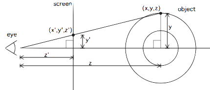
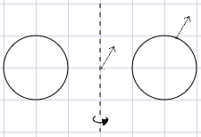

This project is remake of donut.c created by Andy Sloane ([@a1k0n](https://github.com/a1k0n)) following the guide on [https://www.a1k0n.net/2011/07/20/donut-math.html](https://www.a1k0n.net/2011/07/20/donut-math.html). 


# How it works

The first thing that I did was define an equation for the cross section of the torus (donut).


Which was given by:
```math
\begin{pmatrix}
x\\
y
\end{pmatrix}
=
\begin{pmatrix}
R_1 + R_2 \sin\theta\\
R_2 \cos \theta
\end{pmatrix}
```

This could have been given as Cartesian equation however, the parametric form makes it easier to iterate over for later.

To give us a torus from this, we will apply a rotation matrix to rotate it around the y-axis.
```math
\begin{pmatrix}
x\\
y\\
z
\end{pmatrix}
=
\begin{pmatrix}
\cos \phi & 0 & -\sin \phi \\
0 & 1 & 0 \\
\sin \phi & 0 & \cos \phi
\end{pmatrix}
\begin{pmatrix}
R_1 + R_2 \sin\theta\\
R_2 \cos \theta\\
0
\end{pmatrix}
```
This equation gives us every point on the torus given by 2 angles.

Next as we want the torus to rotate, we will apply another 2 rotation matrices, it really doesn't matter which axes we rotate it on as long as the first is not about the y-axis (as this would not change anything) and as long as they are not the same. I chose the x-axis and then the z-axis. So now we have:
```math
\begin{pmatrix}
x\\
y\\
z
\end{pmatrix}
=
\begin{pmatrix}
\cos \beta & -\sin \beta & 0 \\
\sin \beta & \cos \beta & 0\\
0 & 0 & 1 
\end{pmatrix}
\begin{pmatrix}
1 & 0 & 0 \\
0 & \cos \alpha & -\sin \alpha \\
0 & \sin \alpha & \cos \alpha 
\end{pmatrix}
\begin{pmatrix}
\cos \phi & 0 & -\sin \phi \\
0 & 1 & 0 \\
\sin \phi & 0 & \cos \phi
\end{pmatrix}
\begin{pmatrix}
R_1 + R_2 \sin\theta\\
R_2 \cos \theta\\
0
\end{pmatrix}
```

Which is a lot but can be simplifies (somewhat) to:
```math
\begin{pmatrix}
x\\
y\\
z
\end{pmatrix}
=
\begin{pmatrix}
\sin \alpha \sin \beta \sin \phi + \cos \beta \cos \phi & - \cos \alpha \sin \beta & \cdots \\
\sin \beta \cos \phi - \sin \alpha \cos \beta \sin \phi & \cos \alpha \cos \beta & \cdots \\
\cos \alpha \sin \phi & \sin \alpha & \cdots 
\end{pmatrix}
\begin{pmatrix}
R_1 + R_2 \sin\theta\\
R_2 \cos \theta\\
0
\end{pmatrix}
```

As you can see, I have not included the last column as this will multiply with 0 when multiplied by the circle, so it is irrelevant. The other thing that you might have noticed is that I have not multiplied out the rotations with the circle, this is purposeful, as you will see later that the rotations will be useful in another place.

## Rendering
### The maths
Before we move on, I will talk about how to render the torus.
Below is a diagram of how the torus is mapped onto the screen. As you can see, the two right angled triangles are similar.



This means that 
$$\frac{y'}{z'} = \frac{y}{z}$$
and therefore
$$y' = \frac{yz'}{z}$$
where $z'$ is the distance to the screen and $z$ is the distance to the point. The same also follows for $x'$. This gives us that the torus projects to $(x′,y′)=(\frac{z'x}{z},\frac{z'y}{z})$.

### The Program
First we will initialise an output buffer the size of the output to an array of spaces. Next we create a z-buffer (an array of floats that will hold $z^{-1}=\frac{1}{z}$ of the points that are plotted there) of the same size initialised to 0 (infinitely far away). We will then iterate over points on the torus by looping over different $\theta$s and $\phi$s and work out the coordinates of those points ( $z$ will have to have the distance to the torus added). You will then have to transform this point onto the screen giving us $x'$ and $y'$. Use this to figure out which character on the screen it relates to. Next work out what $z^{-1}$ is and if it is greater than the value already in the z-buffer then plot the corresponding character into the output buffer.

## Lighting
Now that we have defined the torus and its rotation, we need to work out how to light each point. The first step in doing this is figuring out which way the surface at any given point is facing.
To do this we will create a normal surface vector and centre it at (0, 0).



This vector is given by 
```math
\vec{N}
=
\begin{pmatrix}
R_2 \sin\theta\\
R_2 \cos \theta
\end{pmatrix}
```
If we then transform this vector by the same transformation as the point, we will get the normal to the surface at that point. I.e.
```math
\begin{pmatrix}
\sin \alpha \sin \beta \sin \phi + \cos \beta \cos \phi & - \cos \alpha \sin \beta & \cdots \\
\sin \beta \cos \phi - \sin \alpha \cos \beta \sin \phi & \cos \alpha \cos \beta & \cdots \\
\cos \alpha \sin \phi & \sin \alpha & \cdots 
\end{pmatrix}
\begin{pmatrix}
R_2 \sin\theta\\
R_2 \cos \theta\\
0
\end{pmatrix}
```


